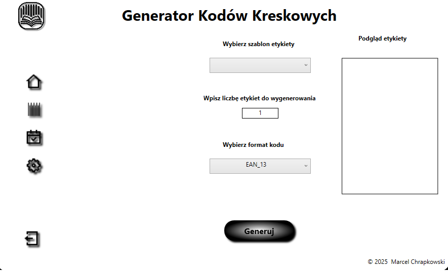
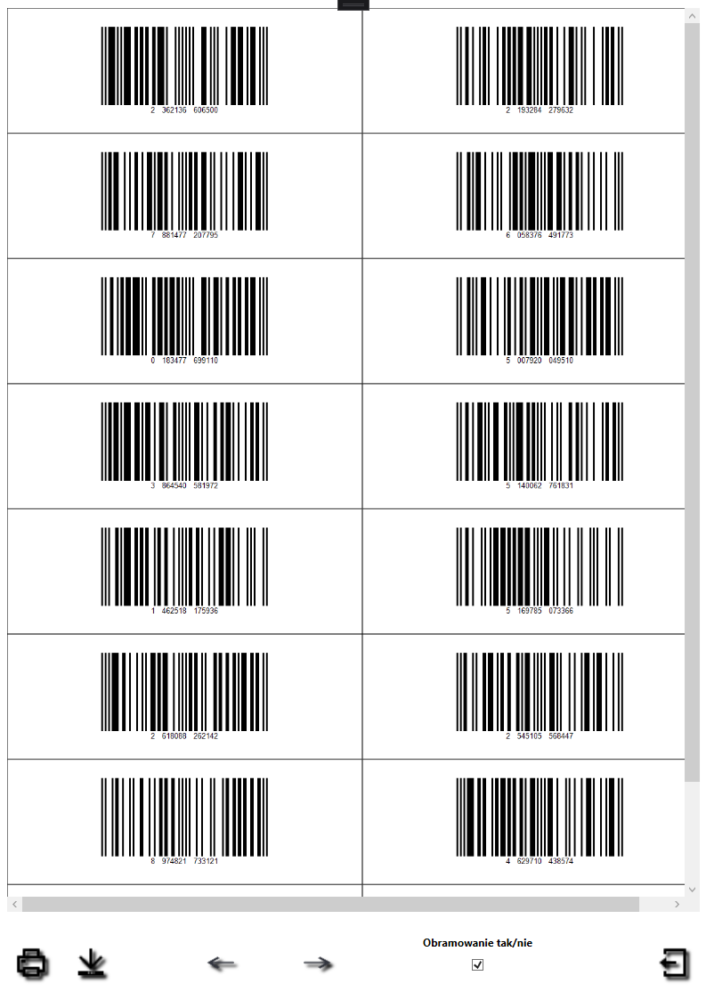

# BarcodeGenerator

A Windows desktop application for creating, managing, and printing barcode labels with support for multiple formats and customizable templates.

## Features

- **Multiple Barcode Types**: EAN-13, EAN-8, CODE 128, CODE 39, and QR Code formats
- **Custom Templates**: Create and save custom label templates with specific dimensions
- **Batch Generation**: Generate multiple unique barcodes at once
- **Manual Entry**: Input specific barcode values manually
- **PDF Export**: Export barcodes as PDF documents with customizable layouts
- **Border Control**: Toggle visibility of label borders for different printing needs
- **Barcode History**: Keep track of previously generated barcodes
- **Multi-page Support**: Generate and preview barcodes across multiple pages

## Screenshots

## Installation

1. Download the latest release from the [Releases page](https://github.com/marquel83/BarcodeGenerator/releases)
2. Extract the ZIP file to your preferred location
3. Run `BarcodeGenerator.exe` to start the application

## Requirements

- Windows 7 or higher
- .NET Framework 4.6.1 or higher

## Quick Start

1. **Select a Template**: Choose an existing label template or create a new one
2. **Choose Barcode Type**: Select your desired barcode format
3. **Generate Barcodes**: Enter the number of barcodes or input specific values
4. **Export or Print**: Save as PDF or print directly from the result window

## Documentation

For detailed usage instructions and technical information, please see the [Documentation](DOCUMENTATION.md).

## License

This project is licensed under the MIT License - see the [LICENSE](LICENSE) file for details.

## Acknowledgments

- [QuestPDF](https://www.questpdf.com/) - Used for PDF generation (Community License)
- [ZXing.Net](https://github.com/micjahn/ZXing.Net) - Used for barcode generation

## Contributing

Contributions are welcome! Please feel free to submit a Pull Request.

## Support

If you encounter any issues or have questions, please [open an issue](https://github.com/marquel83/BarcodeGenerator/issues).
